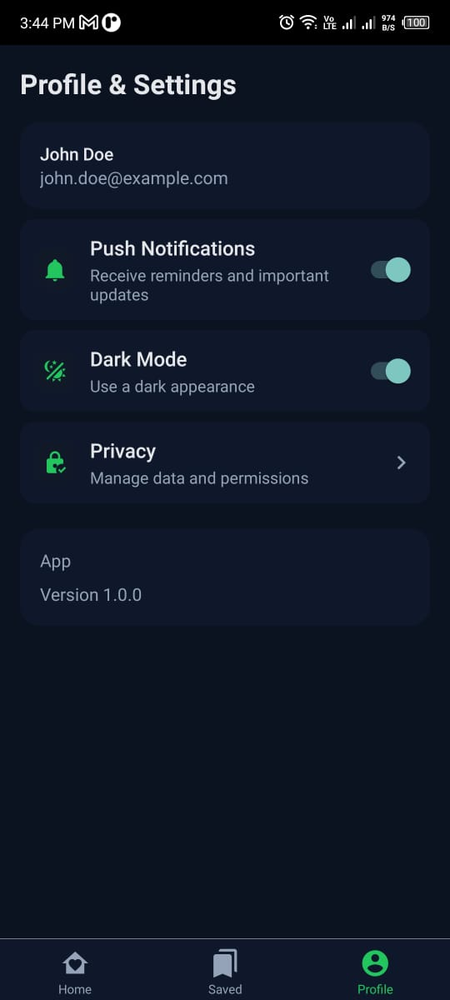
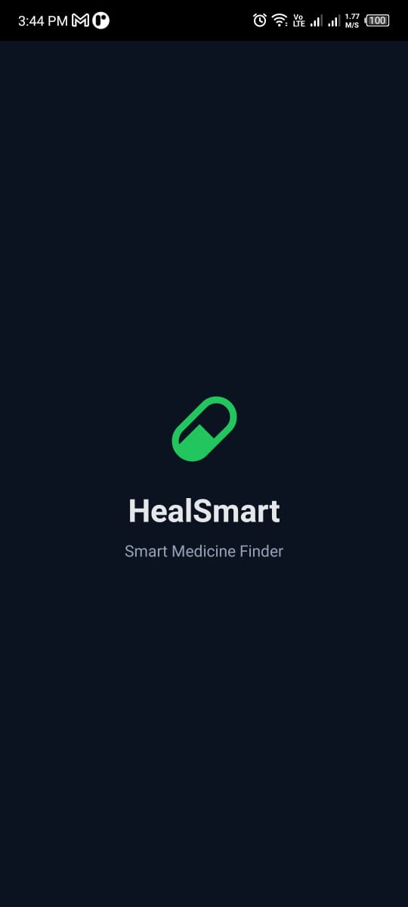
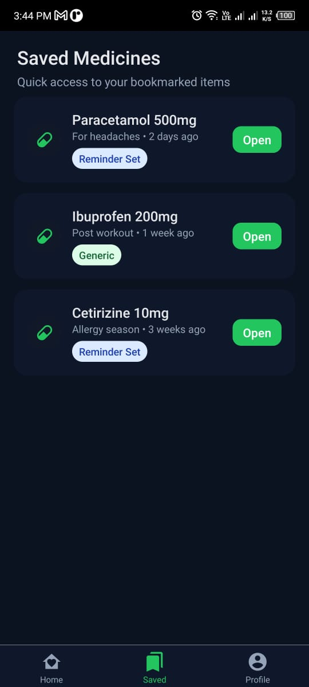

# HealSmart: Your Personal Health Companion

HealSmart is a cross-platform mobile app designed to help you manage your medicines, track alternatives, and visualize your health journey—all in a beautiful, modern interface.

---

## 🖼️ Preview
| Home Screen | Medicine Details | Alternatives |
|:-----------:|:---------------:|:------------:|
|  |  |  |

---

## ✨ Features

- 💊 **Medicine Management:** Scan, save, and view detailed info about your medicines.
- 🔄 **Alternatives Finder:** Instantly discover alternative medicines.
- 📊 **Price Comparison:** Compare prices for smarter choices.
- 🗂️ **Saved Medicines:** Bookmark and organize your medicines.
- 👤 **Profile & Onboarding:** Personalized onboarding and profile management.
- 🌙 **Modern UI:** Responsive, user-friendly interface with light/dark mode.

---

## 📁 Project Structure

```
HealSmart/
├── assets/                # Images and static assets
├── src/
│   ├── data/              # Dummy data
│   ├── navigation/        # Navigation setup
│   ├── screens/           # App screens (Home, Details, etc.)
│   ├── types/             # TypeScript types
│   └── ui/                # UI components & styles
├── android/               # Android native code
├── ios/                   # iOS native code
├── App.tsx                # App entry point
├── package.json           # Project metadata & dependencies
└── ...
```

---

## 🛠️ Getting Started

1. **Install Dependencies**
   ```sh
   npm install
   ```
2. **Start Metro Bundler**
   ```sh
   npm run start
   ```
3. **Run on Android**
   ```sh
   npm run android
   ```
4. **Run on iOS**
   ```sh
   npm run ios
   ```
5. **Type Check (optional)**
   ```sh
   npm run typecheck
   ```
6. **Format (optional)**
   ```sh
   npm run format
   ```

---

## 📝 License
This project is licensed under the MIT License. See the LICENSE file for details.

---

## 👨‍💻 Author

**Ghulam Mujtaba**  
BS Software Engineering | COMSATS Lahore  
[🌐 Portfolio](https://ghulammujtaba.com) | [LinkedIn](https://linkedin.com/in/ghulamujtabaofficial) | [GitHub](https://github.com/ghulam-mujtaba5)

---