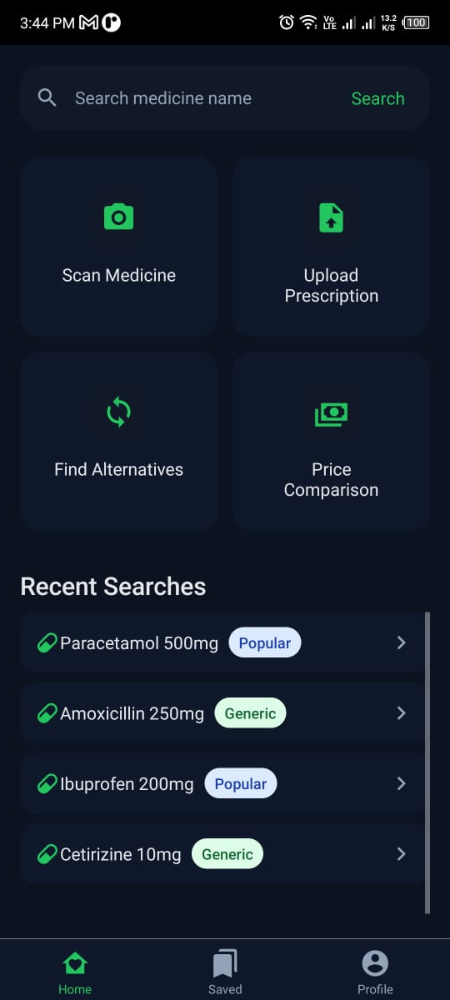

# HealSmart - Your Smart Medicine Assistant

HealSmart is a comprehensive mobile application designed to help users manage their medications, find alternatives, compare prices, and get detailed information about their medicines. It's your one-stop solution for all your medication-related needs.

## 📸 Screenshots

| Onboarding | Home | Medicine Details | Alternatives |
|---|---|---|---|
|  |  |  |  |

## ✨ Features

- **Scan Medicines:** Quickly scan your medicine's packaging to get instant details.
- **Medicine Details:** Access comprehensive information about your medicines, including composition, side effects, and usage instructions.
- **Find Alternatives:** Discover generic and alternative medicines to make informed choices.
- **Price Comparison:** Compare prices of the same medicine from different pharmacies to find the best deal.
- **Save Medicines:** Keep a list of your important medications for quick access.
- **User Profiles:** Manage your personal information and preferences.
- **Sleek UI:** A modern and intuitive user interface built with performance in mind.

## 🚀 Technologies Used

- **React Native:** A framework for building native apps using React.
- **TypeScript:** For static typing and improved developer experience.
- **Tailwind CSS:** For a utility-first CSS styling approach.
- **React Navigation:** For handling routing and navigation within the app.

## 📦 Getting Started

### Prerequisites

- Node.js
- npm or yarn
- React Native CLI
- Android Studio or Xcode for running on an emulator or device.

### Installation & Running the app

1. **Clone the repository:**
   ```bash
   git clone https://github.com/your-username/HealSmart.git
   cd HealSmart
   ```

2. **Install dependencies:**
   ```bash
   npm install
   ```
   or
   ```bash
   yarn install
   ```

3. **Run on Android:**
   ```bash
   npx react-native run-android
   ```

4. **Run on iOS:**
   ```bash
   npx react-native run-ios
   ```

5. **Start Metro with cache reset:**
   ```bash
   npx react-native start --reset-cache
   ```

6. **In a new terminal, reinstall the app:**
   ```bash
   npx react-native run-android
   ```

## 🤝 Contributing

Contributions are welcome! Please feel free to submit a Pull Request.

## 📝 License

This project is licensed under the MIT License. See the `LICENSE` file for details.